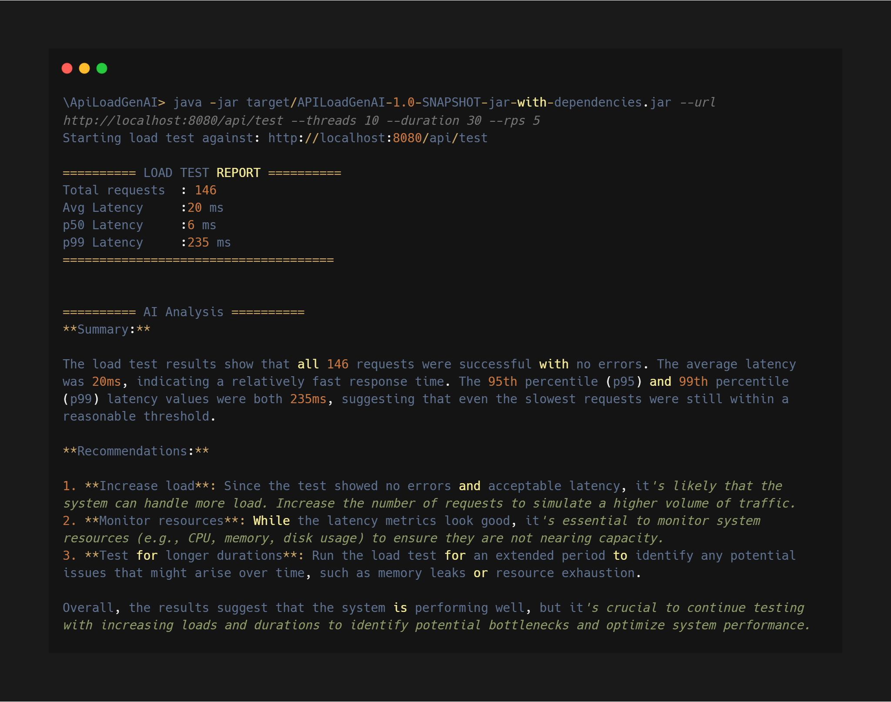

<div align="center">

# APILoadGenAI: High-Concurrency API Stress Tester

A lightweight, high-performance Java load testing utility designed to simulate concurrent traffic, evaluate API stability and analyze API behavior under load.

</div>
<p align="center">


</p>

---

## Core Architecture

APILoadGenAI combines load generation, concurrent execution, metrics collection, and AI-driven analysis into a single workflow. Requests are executed through Java 21 virtual threads, performance data is gathered during execution, and the results are analyzed by an LLM to identify API behavior and performance characteristics.

## Features

* **Virtual Thread Concurrency:** Java 21 Virtual Threads drive high request volumes with minimal overhead.
* **AI-Generated Chaos Payloads:** Each request carries a unique Groq-generated JSON payload, surfacing edge cases static data misses.
* **Continuous Integration:** GitHub Actions automatically runs the test suite on every push.
* **Real-Time Latency Metrics:** Tracks P50, P95, and P99 latencies plus success/error counts as the run executes.
* **LLM-Powered Post-Run Analysis:** LLaMA 3.3 70B breaks down results with concrete recommendations.

* **Automated Testing:** Core components are covered by JUnit and integration tests.<br>
 Code coverage is measured using JaCoCo.

## Sample Output



---

## Testing

JUnit and integration tests cover the core logic classes:

| Class | Coverage |
|---|---|
| `LoadConfig` | CLI arg parsing and validation |
| `MetricsCollector` | Latency math, percentile calculation, success/error counts |
| `ReportPrinter` | Report output formatting |
| `HttpClientWrapper` | Integration test against a local in-process HTTP server |

```bash
mvn test
```

## Target Server

A lightweight Spring Boot API is available for local testing:
[JavaLabs-io/target-api](https://github.com/JavaLabs-io/target-api)

```bash
git clone https://github.com/JavaLabs-io/target-api.git
cd target-api
mvn spring-boot:run
# runs on localhost:8080
```

## Getting Started

### Prerequisites

* Java 21+
* Maven 3.9+
* [Groq API key](https://console.groq.com)

### Installation & Execution

```bash
git clone https://github.com/SiddhiikaN/APILoadGenAI.git
cd APILoadGenAI
```

Create `.env` in the root:

```
GROQ_API_KEY=your_key_here
```

```bash
mvn package -DskipTests
```

### CLI Args

| Flag | Description | Default |
|---|---|---|
| `--url` | Target API endpoint | `http://localhost:8080/api/test` |
| `--threads` | Number of virtual threads | `10` |
| `--duration` | Test duration in seconds | `30` |
| `--rps` | Requests per second | `5` |

```bash
java -jar target/APILoadGenAI-1.0-SNAPSHOT-jar-with-dependencies.jar \
  --url http://localhost:8080/api/test \
  --threads 10 \
  --duration 30 \
  --rps 5
```

CI runs the suite automatically via GitHub Actions on every push.

---

<div align="center">
<sub><a href="https://github.com/SiddhiikaN">Siddhika Nagarkar</a></sub>
</div>
