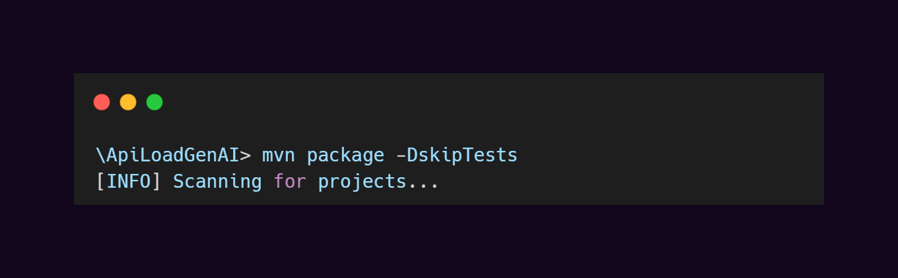
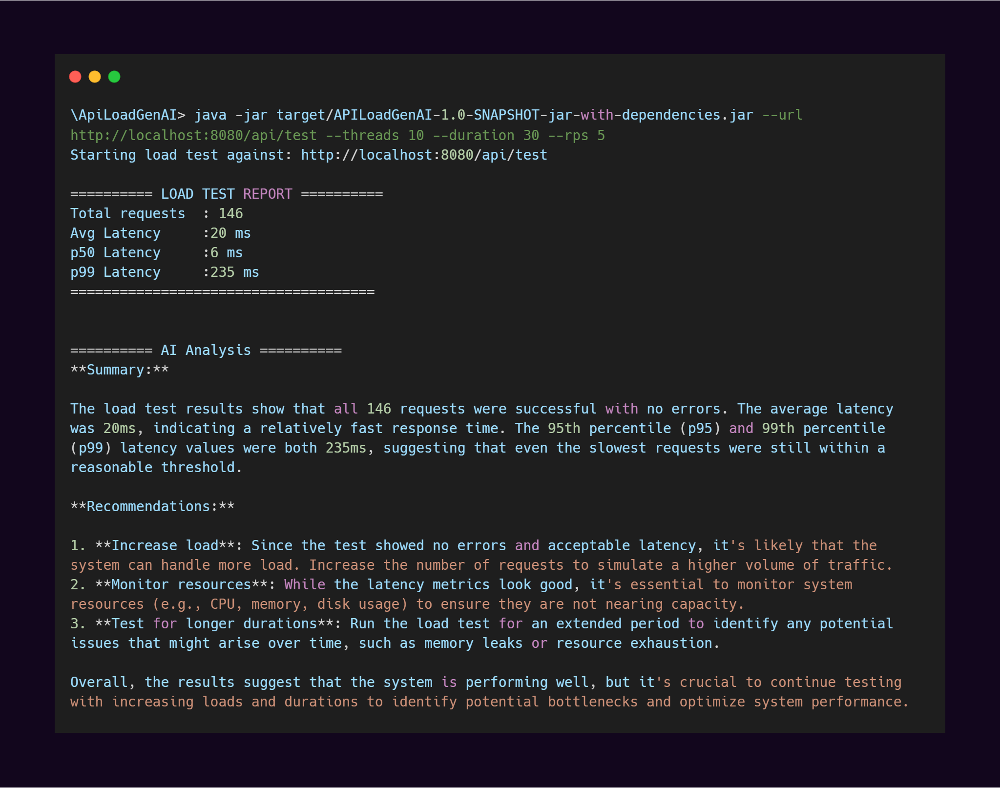

<div align="center">

# APILoadGenAI: High-Concurrency API Stress Tester

A lightweight, high-performance Java load testing utility designed to simulate concurrent traffic, evaluate API stability and analyze API behavior under load.

</div>

## Core Architecture

APILoadGenAI combines load generation, concurrent execution, metrics collection, and AI-driven analysis into a single workflow. Requests are executed through Java 21 virtual threads, performance data is gathered during execution, and the results are analyzed by an LLM to identify API behavior and performance characteristics.

## Key Features

* **Concurrent Execution:** Uses Java 21 Virtual Threads (Project Loom) for high-throughput request handling with minimal overhead.
* **AI Chaos Payloads:** Every request carries a unique AI-generated JSON payload via Groq.
* **Latency Percentiles:** Computes real-time P50, P95, and P99 response latencies.
* **AI-Powered Analysis:** Post-run results analyzed by LLaMA 3.3 70B with actionable recommendations.

## Results

 <br>



## Target Server

A lightweight Spring Boot API is available for local testing:
[JavaLabs-io/target-api](https://github.com/JavaLabs-io/target-api)

```bash
git clone https://github.com/JavaLabs-io/target-api.git
cd target-api
mvn spring-boot:run
# runs on localhost:8080
```

## Getting Started

### Prerequisites
* Java 21+
* Maven 3.9+
* [Groq API key](https://console.groq.com)

### Installation & Execution

```bash
git clone https://github.com/SiddhiikaN/APILoadGenAI.git
cd APILoadGenAI
```

Create `.env` in the root:
```
GROQ_API_KEY=your_key_here
```

```bash
mvn package -DskipTests
```

### CLI Args

| Flag | Description | Default |
|---|---|---|
| `--url` | Target API endpoint | `http://localhost:8080/api/test` |
| `--threads` | Number of virtual threads | `10` |
| `--duration` | Test duration in seconds | `30` |
| `--rps` | Requests per second | `5` |

```bash
java -jar target/APILoadGenAI-1.0-SNAPSHOT-jar-with-dependencies.jar \
  --url http://localhost:8080/api/test \
  --threads 10 \
  --duration 30 \
  --rps 5
```

---

<div align="center">
<sub><a href="https://github.com/SiddhiikaN">Siddhika Nagarkar</a></sub>
</div>